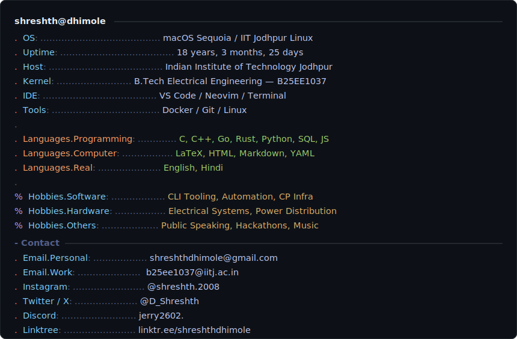

<div align="center">
  
</div>

<br/>

<div align="center">
  <a href="https://git.io/typing-svg">
    
  </a>
</div>

<br/>

<div align="center">
  <a href="https://www.linkedin.com/in/shreshthdhimole/">
    
  </a>
  <a href="https://x.com/D_Shreshth">
    
  </a>
  <a href="mailto:shreshthdhimole@gmail.com">
    
  </a>
  <a href="https://linktr.ee/shreshthdhimole">
    
  </a>
  <a href="https://www.instagram.com/shreshth.2008">
    
  </a>
</div>

<br/>

<div align="center">
  
</div>

---

## 🛠 Tech Stack

<div align="center">


</div>

---

## 🚀 Featured Work

<br/>

<div align="center">

### ⚙️ AutoSetter — *OA problem in. Polygon-ready package out.*

</div>

> **The problem:** Creating a packaged Codeforces problem manually takes **5 to 15 hours**. Formatting the statement, writing test cases, building the solution, stress testing it, and then uploading everything to Polygon — it's a brutal, repetitive grind that every setter dreads.

> **What I built:** An end-to-end automation pipeline. You paste the OA problem text. AutoSetter handles everything — statement formatting, test case generation, solution scripts, stress testing, and Polygon upload — without you touching a single file manually.

> **The result: 5–15 hours → under 20 minutes. Every time.**

<div align="center">

`Python` `Pipeline Automation` `CP Infrastructure` `Polygon API`

[](https://github.com/devlup-labs/AutoSetter)

</div>

---

<div align="center">

### 🏗️ Tata Projects Limited — *Transmission & Distribution Intern*

</div>

> **Where:** Noida, India — Onsite. May 2026 – Present.

> **What I do:** On-site execution support for large-scale electrical infrastructure operations. Working directly with cross-functional engineering teams on transmission and distribution systems — analyzing technical drawings, monitoring electrical systems, ensuring compliance with engineering standards, and building tooling to automate daily site reporting and log analysis pipelines.

> **The environment:** 10,000+ kV infrastructure. The margins for error are not startup-style margins.

<div align="center">

`Electrical Systems` `Power Infrastructure` `AutoCAD` `Technical Documentation` `Python Automation`

</div>

---

## 📊 GitHub Analytics

<div align="center">
  
  
</div>

<br/>

<div align="center">
  
</div>

---

## 📅 Contribution History — Since Day One

<div align="center">

*Every month. Every commit. From account creation.*

</div>

<br/>

<!-- Full account lifetime heatmap — all months since account was created -->
<div align="center">
  
</div>

<br/>

<!-- Month-by-month commit breakdown -->
<div align="center">
  
</div>

<br/>

<!-- Language + commit distribution + productive hours -->
<div align="center">
  
  
  
</div>

<br/>

<!-- Full activity graph -->
<div align="center">
  
</div>

---

## 🧠 Currently Exploring

```python
learning = {
    "systems":    ["memory allocators", "socket programming", "kernel internals"],
    "algorithms": ["advanced graph theory", "segment trees", "competitive math"],
    "hardware":   ["embedded systems", "hardware-software co-design", "VLSI"],
    "building":   ["AutoSetter v2", "EE telemetry tooling", "CP template CLI"],
}
```

---

<br/>

<div align="center">

*"The world is not destroyed by the people who do evil.*
*It is destroyed by the people who watch — and do nothing, because they don't want to seem rude."*

— **James Baldwin** *(adjusted for the internet age)*

</div>

<br/>

<div align="center">
  
</div>
