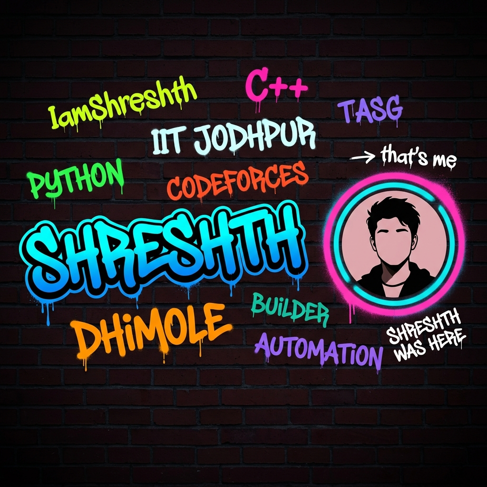

<div align="center">
  
</div>

<br/>

<div align="center">
  <a href="https://git.io/typing-svg">
    
  </a>
</div>

<br/>

<div align="center">
  <a href="https://www.linkedin.com/in/shreshthdhimole/">
    
  </a>
  <a href="https://x.com/D_Shreshth">
    
  </a>
  <a href="mailto:shreshthdhimole@gmail.com">
    
  </a>
  <a href="https://linktr.ee/shreshthdhimole">
    
  </a>
  <a href="https://www.instagram.com/shreshth.2008">
    
  </a>
</div>

<br/>

<div align="center">
  
</div>

---

## `whoami`

```toml
shreshth@dhimole ─────────────────────────────────────────────────────────
  OS       →  B.Tech Electrical Engineering @ IIT Jodhpur
  Role     →  Transmission & Distribution Intern @ Tata Projects, Noida
  Focus    →  Systems Programming · CLI Tooling · Automation Pipelines
  CP       →  Codeforces Active — algorithmic edge cases are my hobby
  Stack    →  C · C++ · Python · SQL · JavaScript · React
  Contact  →  shreshthdhimole@gmail.com
───────────────────────────────────────────────────────────────────────────
```

I build tools that cut through complexity — not just solutions, but **systems**. Whether that's writing C parsers that outrun Python equivalents or engineering pipelines that compress 15-hour workflows into 20 minutes, I optimize for speed, reliability, and zero-friction execution.

---

## 🛠 Tech Stack

<div align="center">

**Languages**


**Frontend & Tools**


</div>

---

## 🚀 Featured Projects

<table>
  <tr>
    <td width="50%" valign="top">

### ⚙️ AutoSetter
> *OA problem → Polygon-ready package. Automatically.*

**Problem:** Creating a packaged Codeforces problem manually takes 5–15 hours — formatting the statement, writing test cases, stress testing, and uploading to Polygon is a brutal, repetitive grind for setters.

**Solution:** An end-to-end Python automation pipeline. Paste any OA problem text → AutoSetter handles everything: statement formatting, test case generation, solution scripts, stress testing, and Polygon upload.

**Impact: 5–15 hours → under 20 minutes. Every single time.**

`Python` `Automation` `CP Infrastructure` `Polygon API`

[](https://github.com/devlup-labs/AutoSetter)

  </td>
  <td width="50%" valign="top">

### 📂 File Organiser
> *Zero-error, cross-platform directory automation.*

**Problem:** File organization scripts routinely break across OS boundaries — macOS quarantine attributes, deep permission trees, and inconsistent path handling cause silent failures.

**Solution:** A robust Python CLI utility with extensible config rules, a `--dry-run` mode for safe preview, granular logging per operation, and explicit handling for macOS quarantine metadata and directory permissions.

**Impact:** Reliable, repeatable multi-directory organization with full audit logs — no unexpected deletions.

`Python` `CLI Architecture` `OS Module` `Cross-Platform`

[](https://github.com/IamShreshth/File-Organiser)

  </td>
  </tr>
  <tr>
    <td width="50%" valign="top">

### 💬 WhatsApp Chat Analyzer
> *C-speed log parsing where Python overhead is not an option.*

**Problem:** Python-based chat analyzers choke on massive `.txt` exports with thousands of multi-line messages — fragile regex, slow I/O, and inaccurate multiline state handling.

**Solution:** Built entirely in C. Uses a custom string tokenization pipeline (`sscanf` + pointer arithmetic), stateful processing to correctly handle multi-line WhatsApp messages, and an array-based histogram algorithm for time-series engagement binning.

**Impact: 95% accuracy** on peak engagement hour extraction with near-instant execution on files of any size.

`C` `Pointer Arithmetic` `Stateful Parsing` `Data Structures`

[](https://github.com/IamShreshth/WhatsApp-Chat-Analyzer)

  </td>
  <td width="50%" valign="top">

### 🏗️ Currently Building
> *Infrastructure meets code.*

Interning at **Tata Projects Limited** (Transmission & Distribution, Noida) — on-site execution for large-scale electrical infrastructure. Applying EE fundamentals while building tooling to automate daily reporting and log analysis pipelines on the side.

**Stack in use:** Python · AutoCAD · Technical Drawing Analysis · Cross-functional Engineering

> *"The best automation is the one no one has to think about."*

  </td>
  </tr>
</table>

---

## 📊 GitHub Analytics

<div align="center">
  
  
</div>

<br/>

<div align="center">
  
</div>

<br/>

<div align="center">
  
</div>

---

## 🧠 Currently Exploring

```python
learning = {
    "systems":    ["memory allocators", "socket programming", "kernel internals"],
    "algorithms": ["advanced graph theory", "segment trees", "competitive math"],
    "hardware":   ["embedded systems", "hardware-software co-design", "VLSI basics"],
    "building":   ["AutoSetter v2", "EE log telemetry tooling", "CLI template generator"],
}
```

---

## 🤝 Let's Connect

I'm open to collaborating on:
- 🔧 **CLI tools & automation** — anything that eliminates repetitive engineering work
- 🏆 **CP infrastructure** — problem setting, judging tools, automated test suites  
- ⚡ **Electrical + software crossover** — telemetry, monitoring, hardware-adjacent tooling
- 🧩 **Open source** — especially systems-level C/C++/Python projects

<div align="center">

| Platform | Link |
|:---:|:---|
| 📧 Email | [shreshthdhimole@gmail.com](mailto:shreshthdhimole@gmail.com) |
| 💼 LinkedIn | [linkedin.com/in/shreshthdhimole](https://www.linkedin.com/in/shreshthdhimole/) |
| 🐦 X / Twitter | [@D_Shreshth](https://x.com/D_Shreshth) |
| 🌐 Linktree | [linktr.ee/shreshthdhimole](https://linktr.ee/shreshthdhimole) |
| 📸 Instagram | [@shreshth.2008](https://www.instagram.com/shreshth.2008) |

</div>

<br/>

<div align="center">
  
</div>
